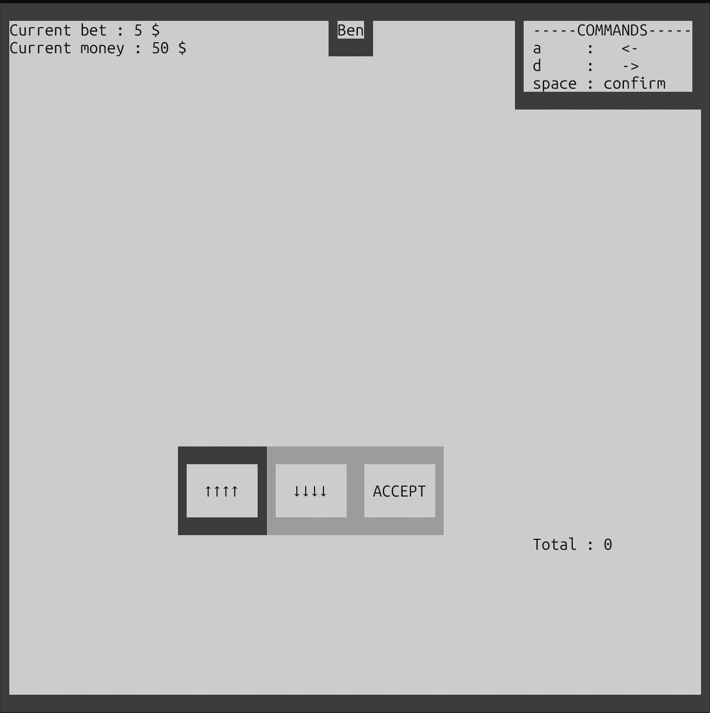
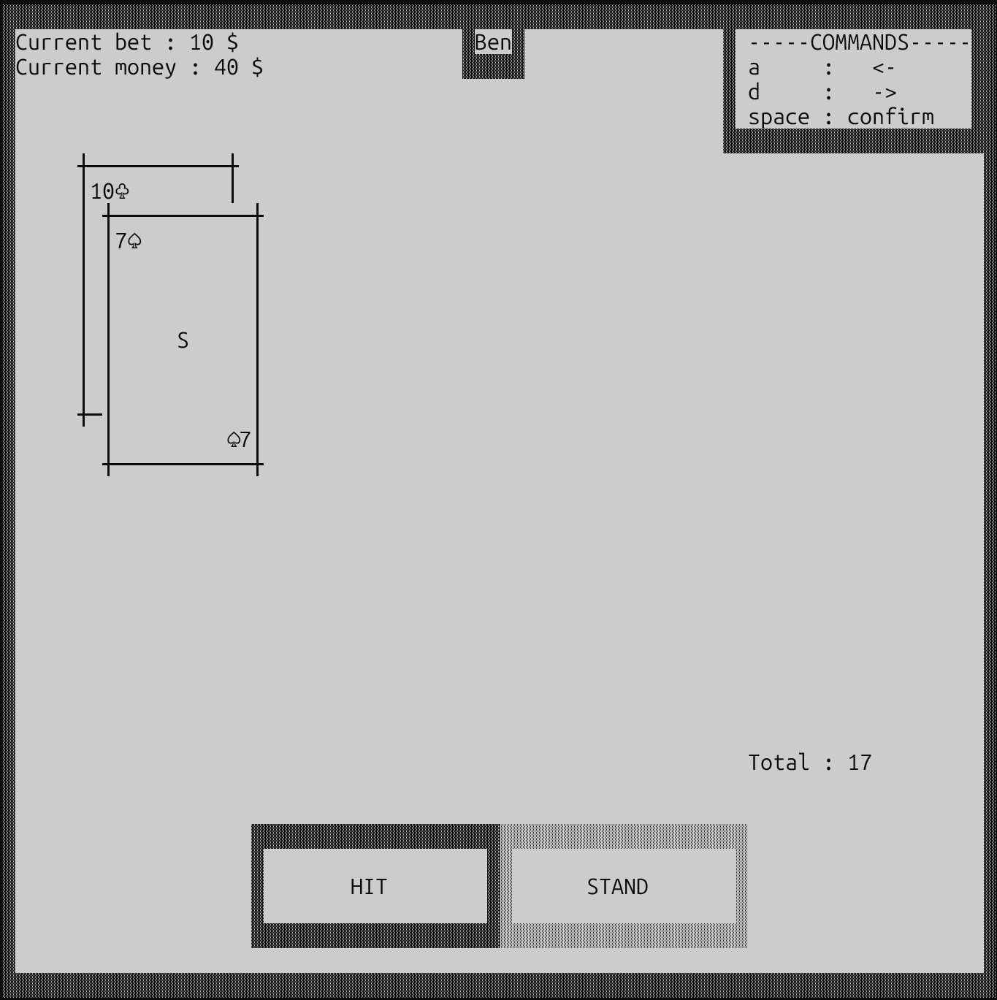
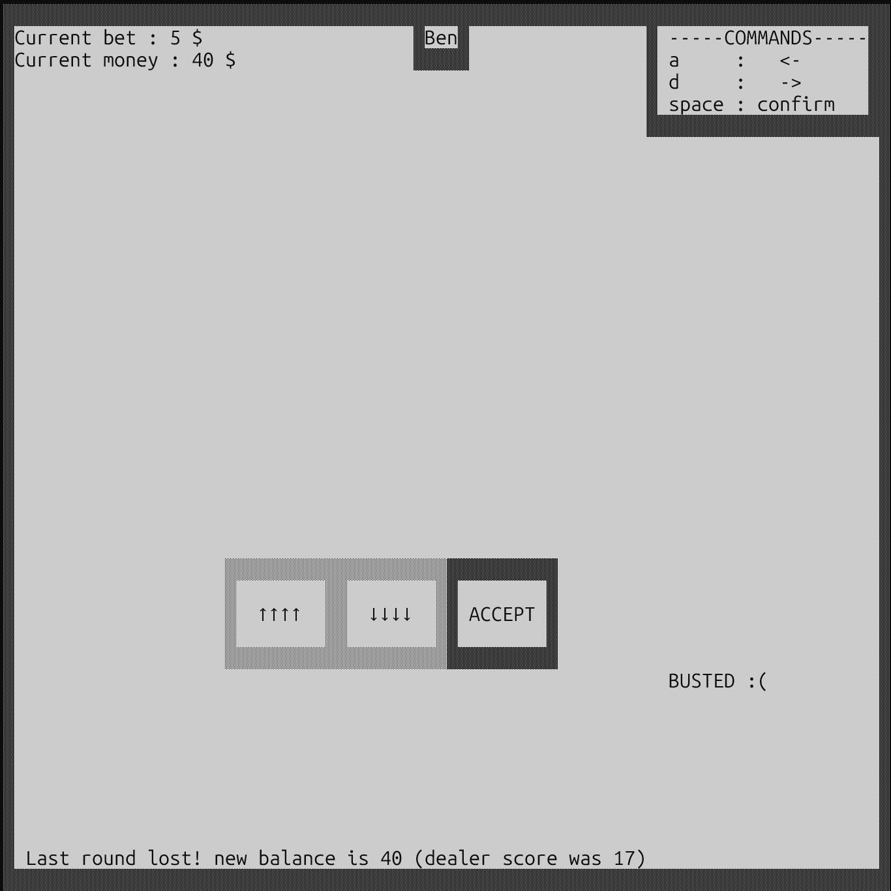
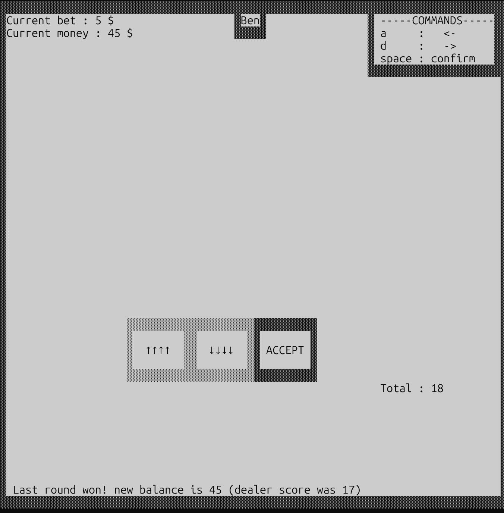

# Blackjack Network Game

## Introduction

This project is a networked Blackjack (21) game where multiple players can play simultaneously against a dealer (server).  
Players can join or leave at any time, place bets, and play their turns independently.  
The server manages the game state, ensures consistency, and handles the dealer logic.

### Application Protocol
The application protocol is explained [here](src/main/java/ch/BJCLI/docs/protocol.md) and the diagram [here](src/main/java/ch/BJCLI/docs/diagram_protocol.md).

---

# How to Launch the Game

Once the project has been built, you can start both the server and the client directly from the command line.
Navigate into the project folder:

```bash
cd BlackJackNetworkGame
```

## Starting the Server

Use the executable JAR located in the `target/` directory:

```bash
java -jar target/BlackJack-1.0-SNAPSHOT.jar server
```

By default, the server listens on its standard port.
If you want to choose a specific port:

```bash
java -jar target/BlackJack-1.0-SNAPSHOT.jar server -p 5000
# or
java -jar target/BlackJack-1.0-SNAPSHOT.jar server --port 5000
```


## Starting a Client

You can open as many clients as you want. Each instance connects to a server:

```bash
java -jar target/BlackJack-1.0-SNAPSHOT.jar client
```

To connect to a specific host and port:

```bash
java -jar target/BlackJack-1.0-SNAPSHOT.jar client -h 127.0.0.1 -p 5000
# or
java -jar target/BlackJack-1.0-SNAPSHOT.jar client --host 127.0.0.1 --port 5000
```

Options:

- ``-p`` / ``--port`` → specify port

- ``-h`` / ``--host`` → specify server host (client only
### Using Docker

#### Prerequisites

* Docker installed on your machine.
* Built project JAR (`target/BlackJack-1.0-SNAPSHOT.jar` exists).


#### Build Docker Images
```
docker build -t blackjack-server:1.0 -f src/main/java/server/Dockerfile.server .
docker build -t blackjack-client:1.0 -f src/main/java/client/Dockerfile.client .
```
#### Run the server :

```bash
docker run --rm -it --network host blackjack-server:1.0
```

#### Run the client :

```bash
docker run --rm -it --network host blackjack-client:1.0 client -h 127.0.0.1 -p 1234
```


* `--rm` → Automatically removes the container when it stops.
* `-it` → Combines `-i` (interactive) and `-t` (allocate a pseudo-TTY), so you can interact with the program in the terminal.
* `--network host` → Uses the host machine’s network directly, so the container can communicate with services running on your host without port mapping.
* `blackjack-client:1.0` / `blackjack-server:1.0` → The name and tag of the Docker image to run.
* `client` / `server` → The command passed to the container to start the client or server application.
* `-h 127.0.0.1 -p 1234` → Options passed to the client to specify the server host and port.


**Verify images:**

```bash
docker images
```

You should see `blackjack-server` and `blackjack-client` with tag `1.0`.

---

## How the Game Works

### Simple Commands with GUI

* `a` – move left
* `d` – move right
* `space` – select/confirm

### Start of the Game

* Players may join in the middle of a round and must wait for the current round to finish.
* At the start of a new round, select your **bet amount**.
* Increase/decrease with `a`/`d` and confirm with `space`.
* If time expires, a standard bet amount is applied.
* After betting, receive **two cards** and wait for your turn.

### Playing Your Turn

Options: **HIT**, **STAND** & **BET <VALUE>**

#### HIT

* Draw a new card.
* Choose again between HIT or STAND.
* If total exceeds 21 → **BUST** → `RESULT LOSE`.

#### STAND

* End your turn.
* Wait for dealer and other players to finish.
* Result sent: `RESULT WIN`, `RESULT LOSE`, or `RESULT PUSH`.

#### BET <VALUE>

* The server validates the amount and deals the opening hand.
* If the bet is accepted → you receive two cards.
* If you are not allowed to bet (wrong phase or insufficient funds) → server returns an error.

### All commands consol 

* `JOIN <username>` – Join the game
* `BET <amount>` – Place your bet
* `HIT` – Draw a card
* `STAND` – End your turn
* `QUIT` – Leave the game

Server responses:

* `WELCOME <username>` – Confirmation of join
* `OK BET <value>` – Bet accepted
* `DEAL C1 C2`
* `OK HIT CARD <rank> <suit>` – Received card
* `BUST` – Exceeded 21
* `RESULT <WIN|LOSE|PUSH>` – End of turn
* `ERROR <code> <message>` – Error message
* `GOODBYE` – Confirmation of quit

---
## Gameplay Overview

Here is a visual walkthrough of the game so you can see how to place a bet, request cards, and play a full round of Blackjack.

### Main Menu 

The game starts here. You choose whether to join as a client or start the server.


### Placing a bet

Select the amount you want to bet for the current round. Use the controls to adjust your bet and confirm.

In the image below, $10 has been bet and the dealer has given me two cards. The total value of these two cards is 17.



The user decided to hit, and lost against the dealer. He went BUST.



In the image below, the user has a total of 18 and dealer a total of 17. The dealer lost and the user won.


